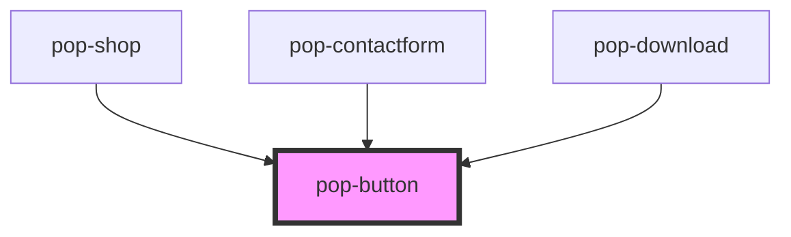

# pop-button

<!-- Auto Generated Below -->

## Properties

| Property | Attribute | Description | Type     | Default     |
| -------- | --------- | ----------- | -------- | ----------- |
| `color`  | `color`   |             | `string` | `undefined` |
| `link`   | `link`    |             | `string` | `undefined` |
| `size`   | `size`    |             | `string` | `undefined` |
| `text`   | `text`    |             | `string` | `undefined` |

## Dependencies

### Used by

 - [pop-shop](../pop-shop)
 - [pop-contactform](../pop-contactform)
 - [pop-download](../pop-download)

### Graph

----------------------------------------------

*Built with [StencilJS](https://stenciljs.com/)*
