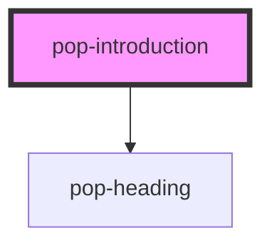

# pop-introduction

<!-- Auto Generated Below -->

## Properties

| Property       | Attribute      | Description | Type  | Default     |
| -------------- | -------------- | ----------- | ----- | ----------- |
| `introduction` | `introduction` |             | `any` | `undefined` |

## Dependencies

### Depends on

- [pop-heading](../pop-heading)

### Graph

----------------------------------------------

*Built with [StencilJS](https://stenciljs.com/)*
